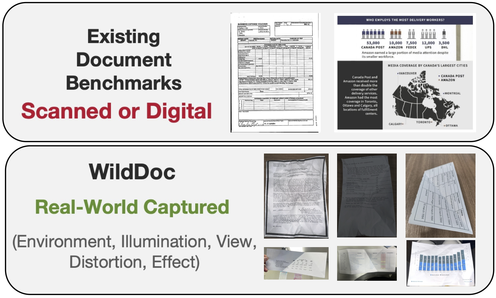
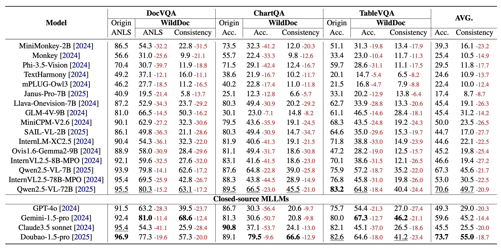

# WildDoc
WildDoc: How Far Are We from Achieving Comprehensive and Robust Document Understanding in the Wild?

<div style="text-align: center;">
    
</div>
> The rapid advancements in Multimodal Large Language Models (MLLMs) have significantly enhanced capabilities in Document Understanding. However, prevailing benchmarks like DocVQA and ChartQA predominantly comprise scanned or digital documents, inadequately reflecting the intricate challenges posed by diverse real-world scenarios such as variable illumination and physical distortions. This paper introduces WildDoc, the inaugural benchmark designed specifically for assessing document understanding in natural environments. WildDoc incorporates a diverse set of manually captured document images reflecting real-world conditions and leverages document sources from established benchmarks to facilitate comprehensive comparisons with digital or scanned documents. Further, to rigorously evaluate model robustness, each document is captured four times under different conditions. Evaluations of state-of-the-art MLLMs on WildDoc expose substantial performance declines and underscore the models’ inadequate robustness compared to traditional benchmarks, highlighting the unique challenges posed by real-world document understanding.

## 🔗 Links
|**[🍎 Project Page](https://bytedance.github.io/WildDoc)** | **[📖 Paper](https://arxiv.org/abs/2505.11015)** |**[📊 Dataset](https://huggingface.co/datasets/ByteDance/WildDoc)** | **[🏆 Leaderboard](https://github.com/bytedance/WildDoc?tab=readme-ov-file#-leaderboard)** 

## 🔥 News
* **`2025.05.16`** 🌟 Doubao-1.5-thinking-VL achieves the best performance overall, congratulations!
* **`2025.05.16`** 🌟 We are excited to launch WildDoc, the first benchmark designed specifically for assessing document understanding in the wild.

## 👀 Data
|[Huggingface Dataset](https://huggingface.co/datasets/ByteDance/WildDoc)

## 📋 Dataset Usage
### -- Huggingface dataloader
```python
from datasets import load_dataset
dataset = load_dataset("ByteDance/WildDoc")
```


## 🔮 Evaluation
We highly recommend using the [VLMEvalKit](https://github.com/open-compass/VLMEvalKit) to evaluate your model.

Otherwise, if you evaluate your model by yourself, after getting the final results, please use the following command to calculate the metrics:
```python
python3 calculate_metric.py --eval_file "Your output file"
```
The output Excel of Qwen2.5-VL-72B-Instruct is provided in the results folder. 

If you want to add your results to the WildDoc leaderboard, email us directly at wanganlan@bytedance.com or tangjingqun@bytedance.com.

## 🏆 LeaderBoard



## Citation
If you wish to refer to the baseline results published here, please use the following BibTeX entries:
```BibTeX
@misc{wang2025wilddoc,
      title={WildDoc: How Far Are We from Achieving Comprehensive and Robust Document Understanding in the Wild?}, 
      author={An-Lan Wang and Jingqun Tang and Liao Lei and Hao Feng and Qi Liu and Xiang Fei and Jinghui Lu and Han Wang and Weiwei Liu and Hao Liu and Yuliang Liu and Xiang Bai and Can Huang},
      year={2025},
      eprint={2505.11015},
      archivePrefix={arXiv},
      primaryClass={cs.CV},
      url={https://arxiv.org/abs/2505.11015}, 
}
```

Additionally, we encourage you to cite the following papers:
```BibTeX
@inproceedings{mathew2021docvqa,
  title={Docvqa: A dataset for vqa on document images},
  author={Mathew, Minesh and Karatzas, Dimosthenis and Jawahar, CV},
  booktitle={Proceedings of the IEEE/CVF winter conference on applications of computer vision},
  pages={2200--2209},
  year={2021}
}
```
```BibTeX
@article{masry2022chartqa,
  title={Chartqa: A benchmark for question answering about charts with visual and logical reasoning},
  author={Masry, Ahmed and Long, Do Xuan and Tan, Jia Qing and Joty, Shafiq and Hoque, Enamul},
  journal={arXiv preprint arXiv:2203.10244},
  year={2022}
}
```
```BibTeX
@article{kim2024tablevqa,
  title={Tablevqa-bench: A visual question answering benchmark on multiple table domains},
  author={Kim, Yoonsik and Yim, Moonbin and Song, Ka Yeon},
  journal={arXiv preprint arXiv:2404.19205},
  year={2024}
}
```

## Licence

[GPL3.0](https://www.gnu.org/licenses/gpl-3.0.en.html)


## Bias, Risks, and Limitations
Your access to and use of this dataset are at your own risk. We do not guarantee the accuracy of this dataset. The dataset is provided “as is” and we make no warranty or representation to you with respect to it and we expressly disclaim, and hereby expressly waive, all warranties, express, implied, statutory or otherwise. This includes, without limitation, warranties of quality, performance, merchantability or fitness for a particular purpose, non-infringement, absence of latent or other defects, accuracy, or the presence or absence of errors, whether or not known or discoverable. In no event will we be liable to you on any legal theory (including, without limitation, negligence) or otherwise for any direct, special, indirect, incidental, consequential, punitive, exemplary, or other losses, costs, expenses, or damages arising out of this public license or use of the licensed material. The disclaimer of warranties and limitation of liability provided above shall be interpreted in a manner that, to the extent possible, most closely approximates an absolute disclaimer and waiver of all liability.
